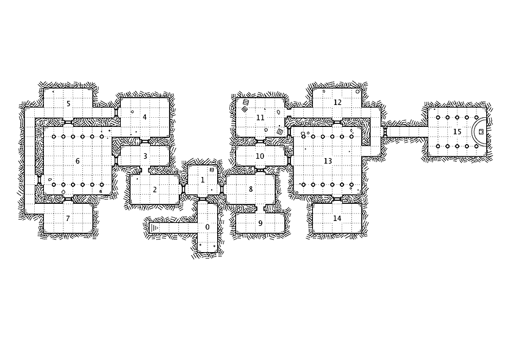

# The Castle on Potter's Rock

## Review
Mellen wakes in the dead of night to find herself lost in the woods. She's still in her bedroll, but her campsite, companions, and gear are missing. It's pitch black and the sky above the forest canopy is rumbling, threatening to rain any moment.

## Important NPCs
| Name | Description |
|:---:|:--- |
| Hans | Creepy butler, missing the flesh of his back |
| Faroe | Shy servant girl, disfigured face and cuts all over |
| Geraldine | Confused, armless young woman trying to pick up books to read in the library |
| Sir Mirrus | Noble knight, only a head, missing his body |
| Lady Augustin | Kind and helpful, wearing a frilly ballgown w/ guts spilling down the front |
| Lord Augustin | Crazed cannibal, feasted on his family |
| Sog the Demon | Wretched temptor from Hell, trapped in a stone |

## Goal
Find safety from the storm and survive the night.

## Locations & Obstacles

| Room | Description |
|:---:|:--- |
|  0 | Entrance; iron doors, heavy knocker, stained glass; **Hans** |
|  1 | Foyer; dusty chandelier, moth-eaten rug |
|  2 | Library; tall bookshelves, rotting books, broken furniture; **Geraldine** |
|  3 |  |
|  4 |  |
|  5 | Kitchen; dirty floors, powerful smell, bloody tools; **Faroe** |
|  6 | Dining hall; dark curtains, long table, dead flowers, bones; **Sir Mirrus** |
|  7 | Wine cellar; blood-filled wine bottles; **Lord Augustin** |
|  8 | Tea room; small round table, one chair standing, smell of roses; **Geraldine** |
|  9 | Wash closet; dark and stale; key in sink |
| 10 | Study; broken desk, wet papers, smelly suit of armor; Sir Mirrus' body inside armor |
| 11 | Master bedroom; expensive dark-wood furniture, heavy curtains; **Lady Augustin** |
| 12 | Servant's quarters; cots with bedrolls filled with rotten straw, tiny bathroom adjacent; **Hans** |
| 13 | Ballroom; ceiling caved in, rain pouring down |
| 14 | Garden; barren, empty planting boxes, abandoned tools, missing spade; **Faroe** |
| 15 | Cemetary; overgrown, faded tombstones, need blood to open; **Sog**, key to exit |

## Revelations
1. The castle is haunted by ghosts.
2. The ghosts are victims of the "master of the house", Lord Augustin.
3. Lord Augustin is a power-mad cannibal.
4. Lord Augustin believes that eating his family would prolong his life.
5. He believes this because of a prophecy he found carved in stone beneath his house.
6. The stone made him mad, whispering evil things into his ear until he lost his mind.
7. The stone is possessed by a demon named Sog.
8. Sog feasts on the misery of the trapped ghosts.
9. Lord Augustin is dead and a ghost as well, regretful and confused.
10. Sog cannot leave the rock or he'll die; use spade to dig up the black bones below the rock and kill him.

## Dividends
The reward, should she survive, is escaping with her life!
