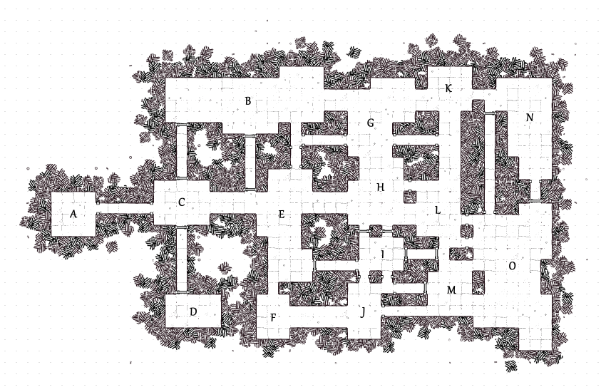
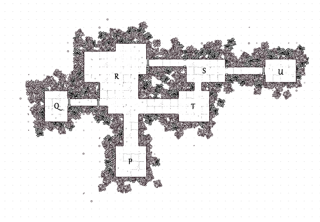

# The Castle on Potter's Rock

## Review
Mellen wakes in the dead of night to find herself lost in the woods. She's still in her bedroll, but her campsite, companions, and gear are missing. It's pitch black and the sky above the forest canopy is rumbling, threatening to rain any moment.

## Important NPCs
| Name | Description |
|:---:|:--- |
| Sir Mirrus | Noble knight, missing his body |
| Lady Augustin | Kind and helpful, wearing a frilly ballgown w/ guts spilling down the front |
| Lord Augustin | Crazed cannibal, feasted on his family |
| Sog the Demon | Wretched temptor from Hell, trapped in a stone |

## Goal
Find safety from the storm and survive the night.

## Locations & Obstacles

| Room | Description |
|:---:|:--- |
| A | Entrance; iron doors, heavy knocker, stained glass |
| B | Library; tall bookshelves, rotting books, broken furniture |
| C | Foyer; dusty chandelier, moth-eaten rug |
| D | Study; broken desk, wet papers |
| E |  |
| F |  |
| G | Dining hall; dark curtains, long table, dead flowers, bones |
| H |  |
| I | Hidden staircase; |
| J |  |
| K | Kitchen; dirty floors, powerful smell, bloody tools |
| L |  |
| M |  |
| N | Cemetary; overgrown, faded tombstones, an empty grave |
| O | Garden; barren, empty planting boxes, abandoned tools, missing spade |

| Room | Description |
|:---:|:--- |
| P | Staircase; creaky wooden stairs leading down into the dank underbelly of the castle |
| Q | Shaft that leads down to a small dock below; exit safely |
| R | Cellar; blood-filled wine bottles |
| S | Body pit; stinking hole in the ground filled with servant victims |
| T | Cellar annex; a bookkeeping room with an old writing desk, at which sits Lord Augustin, a knife in his back |
| U | Sog's stone; hidden behind a locked door |

## Revelations
1. The castle is haunted by ghosts.
2. The ghosts are victims of the "master of the house", Lord Augustin.
3. Lord Augustin is a power-mad cannibal.
4. Lord Augustin believes that eating his family would prolong his life.
5. He believes this because of a prophecy he found carved in stone beneath his house.
6. The stone made him mad, whispering evil things into his ear until he lost his mind.
7. The stone is possessed by a demon named Sog.
8. Sog feasts on the misery of the trapped ghosts.
9. Lord Augustin is dead and a ghost as well.
10. Sog cannot leave the rock or he'll die.

## Dividends
The reward, should she survive, is escaping with her life!
