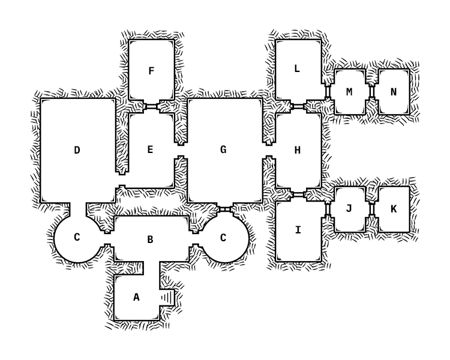

# Sanguine

## Review

## Important NPCs

| Name | Description |
|:---:|:--- |
| Malva | Naiad; dark skin, blue eyes and hair, urban fashion; owner of Sanguine; tough but inviting |
| Ash | Naga; dark, sharp features, pale skin, green eyes, uniform; works as bartender, apron and darkness hide her lower half; defensive and serious |
| Mary | Satyr; soft, curly brown hair and eyes, baggy clothes and beanie, cheeto fingers; DJ and sound engineer; messy and chill |
| Beech | Happened to come to the opening of the club, trying to get away from Hemlock for a little while |
| Dahlia | Also happened to come to the club opening, but with some knowledge that Sorrel would be there |

## Goal
Help Malva to make the club opening a success by performing and mingling with the guests.

## Locations & Obstacles

| # | Name | Description |
|:---:|:---:|:--- |
| A |  |  |
| B |  |  |
| C |  |  |
| D |  |  |
| E |  |  |
| F |  |  |
| G |  |  |
| H |  |  |
| I |  |  |
| J |  |  |
| K |  |  |
| L |  |  |
| M |  |  |
| N |  |  |

## Revelations

1. 
2. 
3. 
4. 
5. 
6. 
7. 

## Dividends

| Name | Description |
|:---:|:--- |
|  |  |
