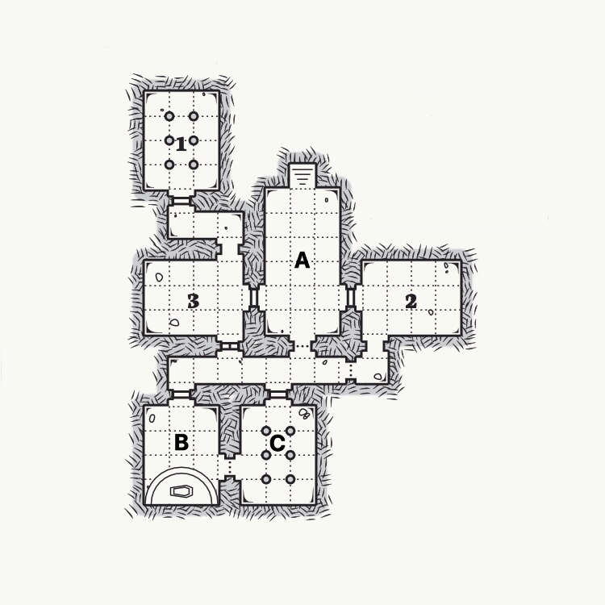

# Yuletide

## Review
Sorrel is a young child out on a holiday vacation with her parents to a ski lodge. At the lodge, Sorrel sleepwalks into the Twilight on accident and gets lost. She has to find her way back to the lodge with the help of three faerie witches, but they won't help for free.

## Important NPCs

| Name | Details |
|:---:|:--- |
| Sugarplum | Petite and purple; Sweet, silly, and playful |
| Winterberry | Round and red; Warm and welcoming but nauseating |
| Mistletoe | Mean and green; Regal and dangerous but also playful |
| Chestnut | Baby troll, stinky |

## Goal
Appease the witches by doing magical chores and earn their help getting back to the lodge.

## Locations & Obstacles

The witches live in an old cottage sitting in a snow-covered evergreen section of the Twilight, partially buried underground.

| # | Name | Details |
|:---:|:---:|:--- |
| 1 | Washing Room | Large tub, sink and mirror, toilet closet  Chestnut the troll baby is in need of a good scrubbing (`CON`) |
| 2 | Bedroom | Mistletoe wants Sorrel to catch the fiddlemouse that's been practicing at night and waking them (`DEX`) |
| 3 | Sanctum | Fireplace, cauldron, shelf of ingredients  Winterberry needs assistance piecing together a love potion made from apple, strawberry, and rose petals (`INT`)  *Taste of cider, petal of rose, Red berry and cupid bows, Brew for minutes three-by-three, Stir with branch of cherry tree, Wait for it to glow and shine, This love potion number nine.* |
| A | Main Hall | Finally, before Sorrel can return home, the witches must teach her how to find open portals (`WIS`) |
| B | Kitchen | Dried herbs hang from the ceiling, fully stocked pantry  Sorrel must aid Sugarplum in baking a yule log cake (`STR`) |
| C | Dining Room | The witches want some entertainment while they eat their dinner (`CHA`) |

## Revelations

1. This is how Sorrel first learned to navigate the Twilight
2. This Yuletide is also when Sorrel's parents gave her the choice between piano and violin

## Dividends

| Name | Details |
|:---:|:--- |
|  |  |
