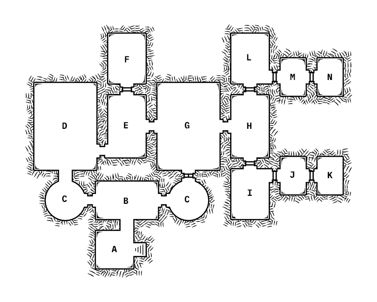

# Launch Party
Fern's friend requested that Sorrel play at the opening night of her club, for pay of course. The club, Sanguine, sits near the Sprawl and is meant as a safe, friendly place for Fae. Dogwood uses music to create a magical area within the building to help galmourize the crowd. Fox is joining Fern and Sorrel as Sorrel's new bodyguard. On their way to the club they've run into a frazzled Hemlock.

1. Redd still in hospital
2. Acquired address from secret map (across the river, in Blackwood territory)
3. Hemlock and Oyster are looking for Beech, but Hemlock doesn't want to admit it
4. Threat ~2 days away

| NPC | Description | Notes |
|:---:|:--- |:--- |
| **Malva** _Naiad Owner_ | Dark skin, blue eyes and hair, urban fashion; welcoming |  |
| **Ash** _Naga Barkeep_ | Sharp features, pale skin, green eyes, uniform; apologetic | Fern's new S.O. |
| **Dogwood** _Satyr DJ_ | Baggy clothes and beanie, cheeto fingers; laidback | Powerful illusion magic |
| **Beech** _Nymph Lackey_ | Ice-blue sequin dress, hair in messy bun; tired | Taking some alone time away from Hemlock and Oyster |
| **Dahlia Richards** _Human_ | Strappy red dress and heels, bob cut; curious | Knew Sorrel would be playing |
| **Thorn** _Satyr Chef_ | Bruises, messy apron; surprisingly friendly | Works for Malva now |

## Sanguine

| ID | Description | Notes |
|:---:|:--- |:--- |
| A | Box Office - line of people impatiently buying/presenting tickets | Malva |
| B | Lobby - bathrooms, benches, and posters |  |
| C | Waiting Area - velvet ropes block the hall entrances |  |
| D | Blackwood Hall - blue, sharp, ice-inspired decor, mini-bar, tables, and dance floor |  |
| E | Green Room - open room with vanities, refreshments, and quick-grab equipment |  |
| F | Equipment Room - backroom filled with wires, consoles, and screens | Dogwood |
| G | Seely Hall - decor like a gilded forest, mini-bar, tables, and dance floor | Beech `Keytar performance:` `AoF12, $Wd10*10` |
| H | VIP Lounge - lush seating area with a stocked bar and tables | Ash, Dahlia |
| I | Kitchen - standard kitchen, very clean | Thorn |
| J | Pantry - locked |  |
| K | Cellar - locked |  |
| L | Malva's Office - locked |  |
| M | Bathroom - luxurious gold and marble decor; secret panel on far wall |  |
| N | Safe Room - locked, secret stairs behind wall | `Salamander hidden below` |

## Synopsis
Sorrel, Fern, and Fox spent some time at Sanguine for the launch party. She met Malva, the naiad club owner, and Dogwood, the saytr sound engineer. Sorrel did a good job playing music for the crowd on the Danaan Hall side and bumped into some musical acquaintances from the past, and also recognized Beech in the crowd (at the back bar, drinking). Fern introduced Sorrel to her new girlfriend, a naga bartender named Ash. Sorrel gets a shot of vodka in her system and is immediately drunk. Dahlia showed up and demanded that Sorrel play music for her to record, to which Sorrel drunkenly agreed. On the way to the recording "studio" (more of a closet, really), Sorrel finds out that Thorn (the saytr from episode one) is working for Malva as a chef. Malva's recording studio came in handy, but thanks to the alcohol Sorrel ended up switching songs in the middle and falling asleep at the end. Dahlia didn't seem to mind, and Sorrel made $300 on top of the $300 she earned from her performance. After coming down from being intoxicated, Malva asks Sorrel for a favor and (after bribing her with another $500), Malva directs her down some secret stairs behind a bookcase in her office. The stairs lead to a tunnel which connects to the sewer; around a corner, Malva shows Sorrel her secret: a fire-breathing salamander, alive and hanging out underneath her club. Malva asks Sorrel to tell her father about the salamander, which seems perfectly happy to stay in this spot where it's safe (for now). Sorrel, Fern, and Fox head for the exit after Sorrel agrees to tell her dad. She runs into Beech on her way out, but didn't say anything.
