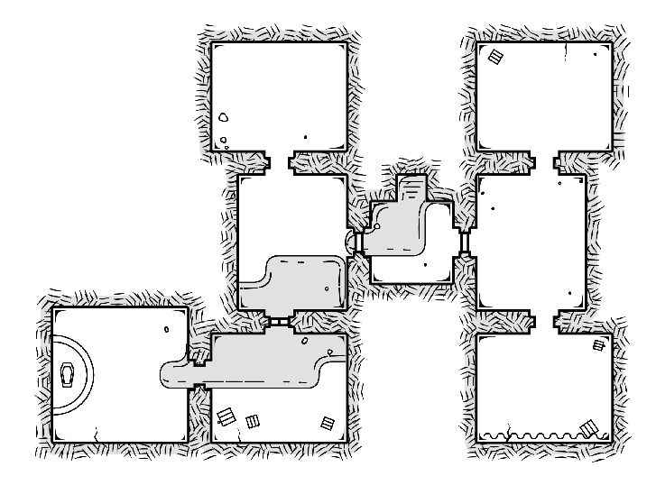

# Quest Name
Sir William is dead and the killer is still on the estate grounds.

| NPC | Description | Notes |
|:--- |:--- |:--- |
| Eames _Butler_ | Tall, wrinkled, and bald with impeccable attire. | `knows William hated cream in his coffee` |
| Cicero _Assassin_ | Dressed as a jester, painted face, dark eyes. | `30hp / str+3 dex+2 int-1 cha-4`  `Loot: 40g and joke dagger` |

### Sir William's Estate - House

| ID | Description | Notes |
|:---:|:--- |:--- |
| A | A dusty storage room filled with ceramic vases | `Secret door to B` |
| B | A slightly dustier room with ceramic cats |  |
