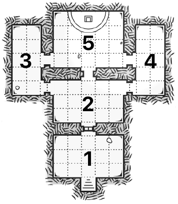

# RINGLORD System

## Review
Bring the player(s) up to speed with some concise exposition.

## Important NPCs
List out the relevant non-player characters, their notable traits, and what they know.

| Name | Details |
|:---:|:--- |
| Krul | - Ghost of a goblin warlord; +1 morningstar; confident, brash, violent - Wants to drain the land of life in attempt to resurrect himself |

## Goal
Give the player(s) a clear goal with clear stakes.

## Locations & Obstacles
Map out the important locations available during this quest. Fill them with traps, puzzles, hostile creatures, and other obstacles that stand between your player(s) and the goal.

### Temple of Krul

1. Secret sealed gate; 
2. Inner sanctum; 
3. Prison cells; 
4. Treasure trove; 
5. Throne room; 

## Revelations
List 7-9 secrets or clues that could be revealed during this quest.

1. 
2. 
3. 
4. 
5. 
6. 
7. 
8. 
9. 

## Dividends
List the rewards your player(s) can gain from this quest including treasure, helpful objects, progress in the overarching narrative, and beneficial relationships.

| Name | Details |
|:---:|:--- |
| Ghostly Helm of Krul | The ghostly cursed helm of the goblin warlod Krul, +5 when intimidating goblins |
