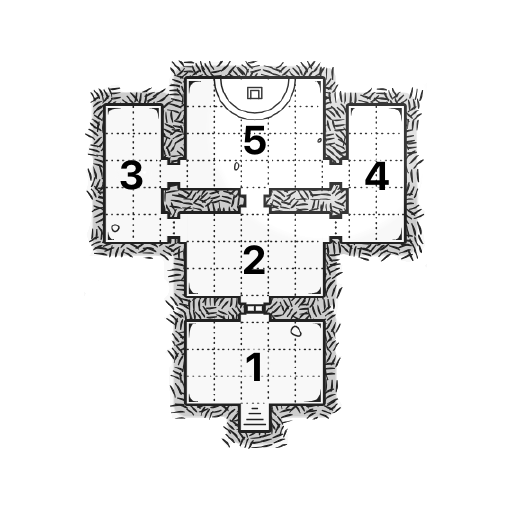

# RINGLORD System

## Review
Bring the player(s) up to speed with some concise exposition.

## Important NPCs
List out the relevant non-player characters, their notable traits, and what they know.

| Name | Details |
|:---:|:--- |
|  |  |

## Goal
Give the player(s) a clear goal and consequences for failure.

## Locations & Obstacles
Map out the locations to which your player(s) have access during this adventure, then fill the locations with traps, puzzles, and hostile creatures that stand between your player(s) and the goal.

1. 
2. 
3. 
4. 
5. 

## Revelations
List 10 secrets that could be revealed during this adventure that may lead to more adventures in the future.

1. 
2. 
3. 
4. 
5. 
6. 
7. 
8. 
9. 
10. 

## Dividends
List the rewards your player(s) can gain from this adventure including treasure, helpful objects, progress in the overarching narrative, and beneficial relationships.

| Name | Details |
|:---:|:--- |
|  |  |